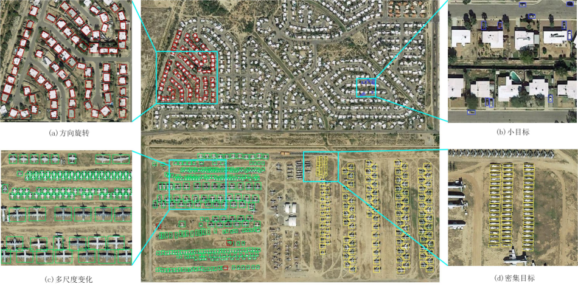

[Download paper here](http://www.infocomm-journal.com/txxb/CN/10.11959/j.issn.1000-436x.2022071)

Object detection is the core issue in the interpretation of optical remote sensing images, and it is widely used in fields such as intelligence reconnaissance, target monitoring, and disaster rescue. Firstly, combined with the research progress of deep learning optical remote sensing image object detection algorithms, the two types of algorithms based on candidate regions and regression analysis were reviewed. Secondly, the improvement of object detection algorithms for four types of common task-specific scenes were summarized, including rotating objects, small objects, multi-scales, and dense objects. Then, combined with commonly used remote sensing image data sets, the performance of different algorithms was compared and analyzed. Finally, the issues worthy of attention in remote sensing image object detection in the future were prospected, and ideas for follow-up related research were provided.

   
 

