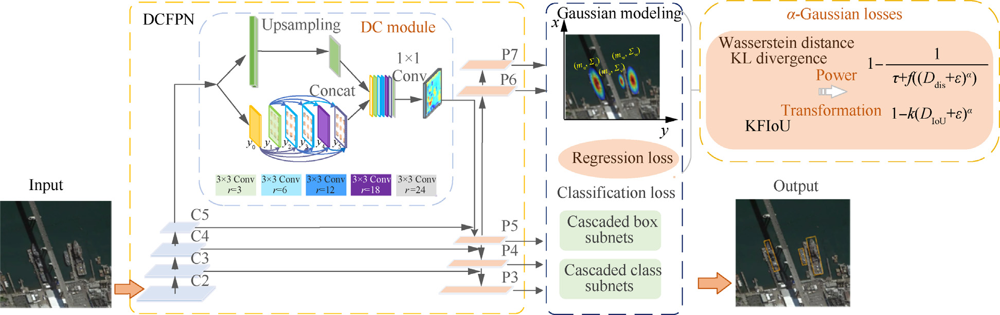

Object detection in Remote Sensing (RS) has achieved tremendous advances in recent years, but it remains challenging for rotated object detection due to cluttered backgrounds, dense object arrangements and the wide range of size variations among objects. To tackle this problem, Dense Context Feature Pyramid Network (DCFPN) and a power a-Gaussian loss are designed for rotated object detection in this paper. The proposed DCFPN can extract multi-scale information densely and accurately by leveraging a dense multi-path dilation layer to cover all sizes of objects in remote sensing scenarios. For more accurate detection while avoiding bottlenecks such as boundary discontinuity in rotated bounding box regression, a-Gaussian loss, a unified power generalization of existing Gaussian modeling losses is proposed. Furthermore, the properties of a-Gaussian loss are analyzed comprehensively for a wider range of applications. Experimental results on four datasets (UCAS-AOD, HRSC2016, DIOR-R, and DOTA) show the effectiveness of the proposed method using different detectors, and are superior to the existing methods in both feature extraction and bounding box regression.

[Download paper here](https://www.sciencedirect.com/science/article/pii/S1000936123001425)

   
 

