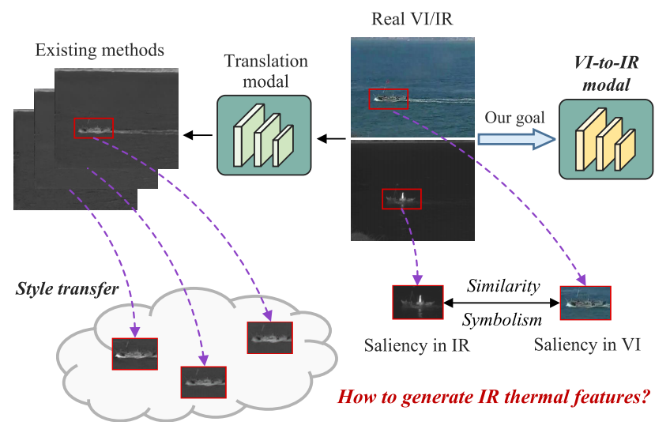

Na Li, Haining Wang, Huijie Zhao†, Wen Ou

[Download paper here](https://ieeexplore.ieee.org/document/11032152)

Weakly supervised visible-to-infrared image translation in remote sensing scenes is a challenging task that attempts to generate corresponding infrared images from visible images with cross-model manner, thus tackling the acute scarcity of infrared data in certain crucial task scenes. Existing methods frequently concentrate solely on style transfer, resulting in stylistic similarity but physical inconsistency, which limits the authenticity of cross-modal translation. Infrared thermal features stemming from brightness and darkness contrasts among distinct regions due to temperature disparities, are associated with visual representations in foreground objects in visible images. Therefore, this paper proposes ThermalMask, a framework for infrared image generation guided by thermal features, aiming to make the generated images more closely with infrared features in remote sensing. Specifically, a saliency mask generation network (SMGN) and a semantic attention generation network (SAGN) are designed in the generator. The SMGN is used to generate background and foreground masks to preserve the background and most prominent features of the input remote sensing image. Meanwhile, the SAGN generates attention maps through pyramid non-local attention mechanism, guiding the network to adaptively focus on salient regions within both visible and infrared feature maps. In addition, to refine the generated infrared features, a pixel-spectrum multi-spatial constraint (PSC) targeting high-frequency components is designed, enabling the generative network to focus more on expressing infrared features. Extensive experiment results have shown that our method has good performance in visible-to-infrared image translation within remote sensing scenes, surpassing existing state-of-the-art image translation methods. Moreover, it holds promise for application in downstream tasks where infrared data is insufficient.

   
 

