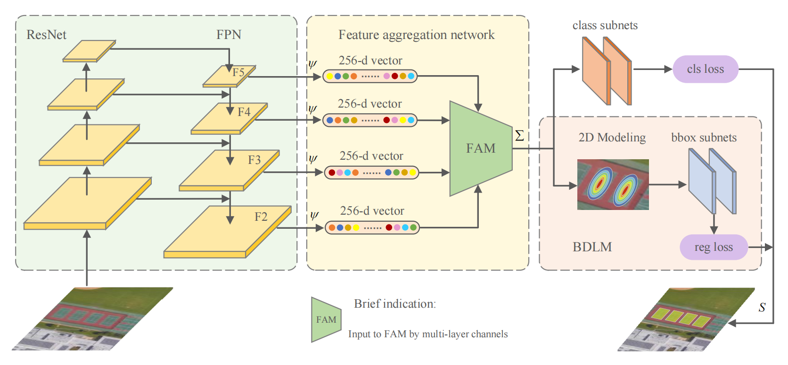

Haining Wang, Yurong Liao, Yang Li, Yuqiang Fang†, Shuyan Ni, Yalun Luo, and Bitao Jiang

[Download paper here](https://ieeexplore.ieee.org/document/9945883)

Rotating object detection in remote sensing image has made substantial progress. However, the widely used feature extraction and fusion modules cannot accurately represent the spatial location and angle information of remote sensing objects in arbitrary orientation. A detection scheme that accurately expresses spatial angle characteristics is necessary when remote sensing objects are densely distributed. This article proposes an effective network for rotating object detection in optical remote sensing image (BDR-Net). First, a feature aggregation module (FAM) is designed to refine the feature extraction of rotating objects, which can generate refined feature maps. Second, 2-D Gaussian modeling simulates the rotation angle information of the object. Third, given that the Bhattacharyya distance is mathematically symmetric and rigorous, we design a Bhattacharyya-distance-based learning module (BDLM). We improve the loss function to more accurately guide the regression of the relative location information of a rotating box. The effectiveness of the proposed method is validated by the results of experiments on three public datasets: DOTA, DIOR, and HRSC2016. The results of our research prove that a Bhattacharyya distance with a Gaussian distribution could be used as an approximate regression loss of the object detection model. This article offers an original approach to combining object detection with metric learning to apply rotating object detection to instrumentation in a deployable and rapid manner.

   
 

