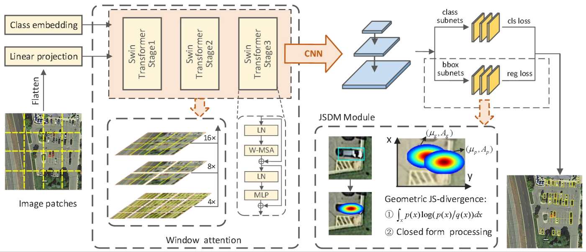

Shuyan Ni, Cunbao Lin, Haining Wang†, Yang Li, Yurong Liao, Na Li

[Download paper here](https://www.frontiersin.org/journals/neurorobotics/articles/10.3389/fnbot.2023.1273251/full)

Tiny objects in remote sensing images only have a few pixels, and the detection difficulty is much higher than that of regular objects. General object detectors lack effective extraction of tiny object features, and are sensitive to the Intersection-over-Union (IoU) calculation and the threshold setting in the prediction stage. Therefore, it is particularly important to design a tiny-object-specific detector that can avoid the above problems. This article proposes the network JSDNet by learning the geometric Jensen-Shannon (JS) divergence representation between Gaussian distributions. First, the Swin Transformer model is integrated into the feature extraction stage as the backbone to improve the feature extraction capability of JSDNet for tiny objects. Second, the anchor box and ground-truth are modeled as two two-dimensional (2D) Gaussian distributions, so that the tiny object is represented as a statistical distribution model. Then, in view of the sensitivity problem faced by the IoU calculation for tiny objects, the JSDM module is designed as a regression sub-network, and the geometric JS divergence between two Gaussian distributions is derived from the perspective of information geometry to guide the regression prediction of anchor boxes. Experiments on the AI-TOD and DOTA datasets show that JSDNet can achieve superior detection performance for tiny objects compared to state-of-the-art general object detectors.

   
 

