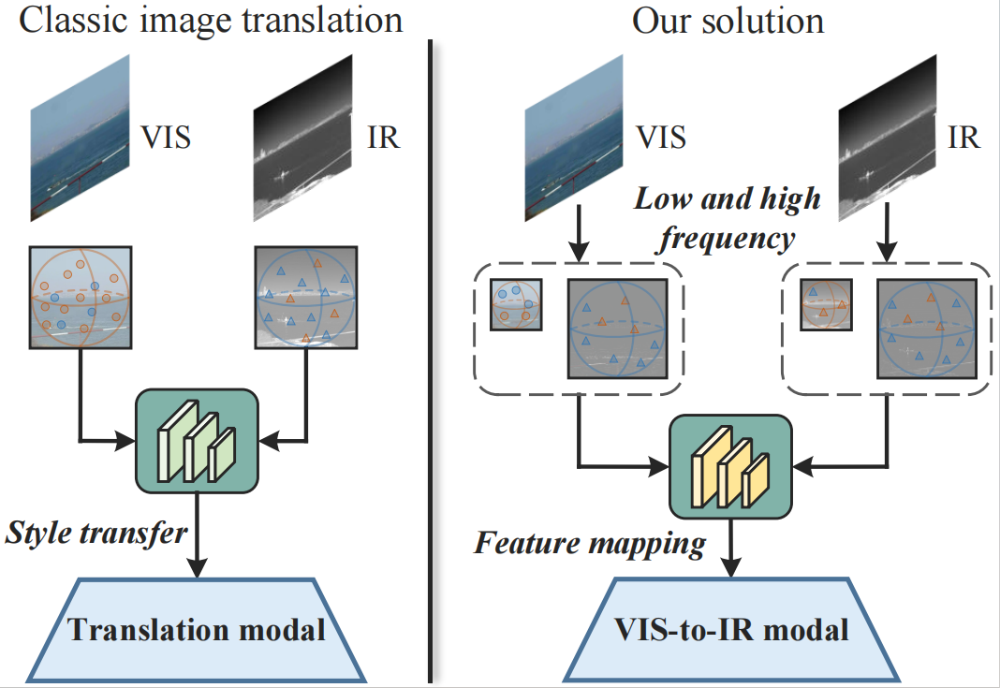

Haining Wang*, Na Li*, Huijie Zhao†, Yan Wen, Yi Su, and Yuqiang Fang

[Download paper here](https://openreview.net/forum?id=BDNtXFXO5n)

Due to the limitations of infrared image acquisition conditions, many essential tasks currently rely on visible images as the main source of training data. However, single-modal data makes it difficult for downstream networks to show optimal performance. Therefore, converting the more easily obtainable visible images into infrared images emerges as an effective remedy to alleviate the critical shortage of infrared data. Yet current methods typically focus solely on transferring visible images to infrared style, while overlooking the crucial infrared thermal feature during cross-modal translation. To elevate the authenticity of cross-model translation at the feature level, this paper introduces a translation network based on frequency feature mapping and dual patches contrast, MappingFormer, which can achieve cross-modal image generation from visible to infrared. Specifically, the generator incorporates two branches: low-frequency feature mapping (LFM) and high-frequency feature refinement (HFR), both have embedded the Swin Transformer blocks. The LFM branch captures the fuzzy structural from visible images, while the HFR focuses on mapping edge and texture features. The extracted dual-branch frequency features undergo refinement and fusion through cross-attention mechanisms. Additionally, a dual contrast learning mechanism based on feature patch (DFPC) is designed to infer effective mappings between unaligned cross-modal data. Numerous experimental results prove the effectiveness of this method in cross-modal feature mapping and image generation from visible to infrared. This method holds significant potential for downstream tasks where infrared data is limited.

   
 

