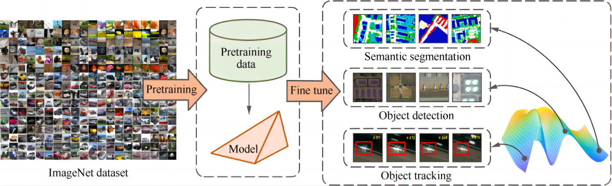

Haining Wang, Yang Li, Yuqiang Fang, Yurong Liao, Bitao Jiang, Xitao Zhang, and Shuyan Ni†

[Download paper here](https://www.sciencedirect.com/science/article/pii/S1000936123000249)

Most of the current object detection algorithms use pretrained models that are trained on ImageNet and then fine-tuned in the network, which can achieve good performance in terms of general object detectors. However, in the field of remote sensing image object detection, as pretrained models are significantly different from remote sensing data, it is meaningful to explore a train-from-scratch technique for remote sensing images. This paper proposes an object detection framework trained from scratch, SRS-Net, and describes the design of a densely connected backbone network to provide integrated hidden layer supervision for the convolution module. Then, two necessary improvement principles are proposed: studying the role of normalization in the network structure, and improving data augmentation methods for remote sensing images. To evaluate the proposed framework, we performed many ablation experiments on the DIOR, DOTA, and AS datasets. The results show that whether using the improved backbone network, the normalization method or training data enhancement strategy, the performance of the object detection network trained from scratch increased. These principles compensate for the lack of pretrained models. Furthermore, we found that SRS-Net could achieve similar to or slightly better performance than baseline methods, and surpassed most advanced general detectors.

   
 

